# Benchmark plots

- Summary: `/home/cc/projects/mq-bench/results/fanin_steady_load/raw_data/summary.csv`

## Table of contents

- [Throughput vs Publishers](#throughput-vs-publishers)
- [Latency vs Publishers](#latency-vs-publishers)
- [Resource Usage vs Publishers](#resource-usage-vs-publishers)
- [Network Usage vs Publishers](#network-usage-vs-publishers)

## Throughput vs Publishers

### payload=1024B

**Log Scale:**

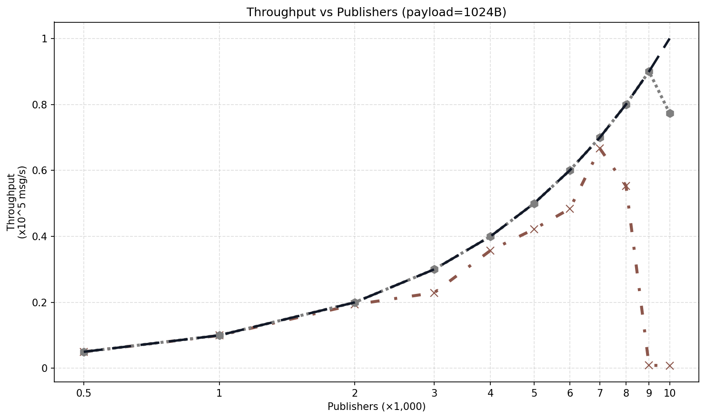

**Linear Scale:**

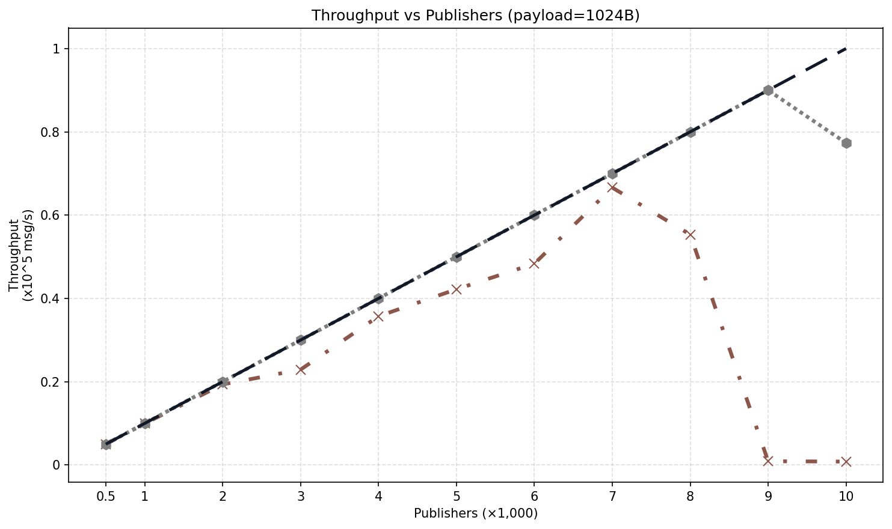

## Latency vs Publishers

### P50 latency

#### payload=1024B

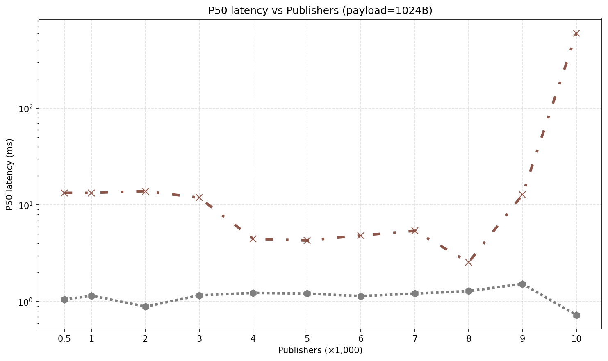

### P95 latency

#### payload=1024B

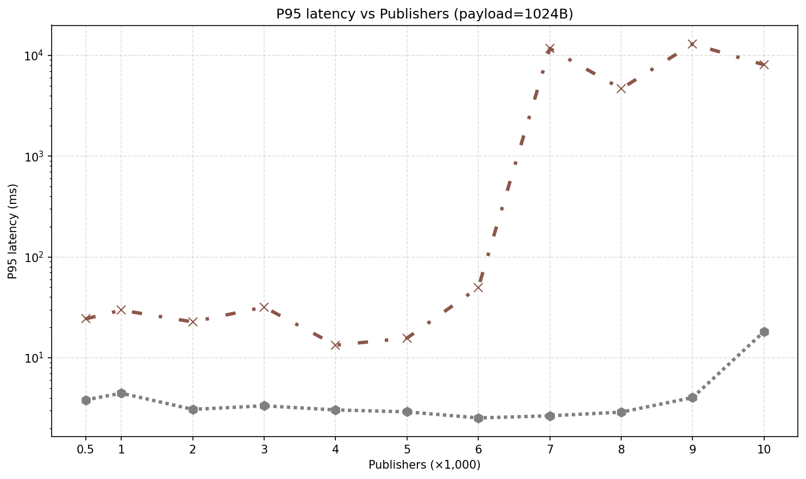

### P99 latency

#### payload=1024B

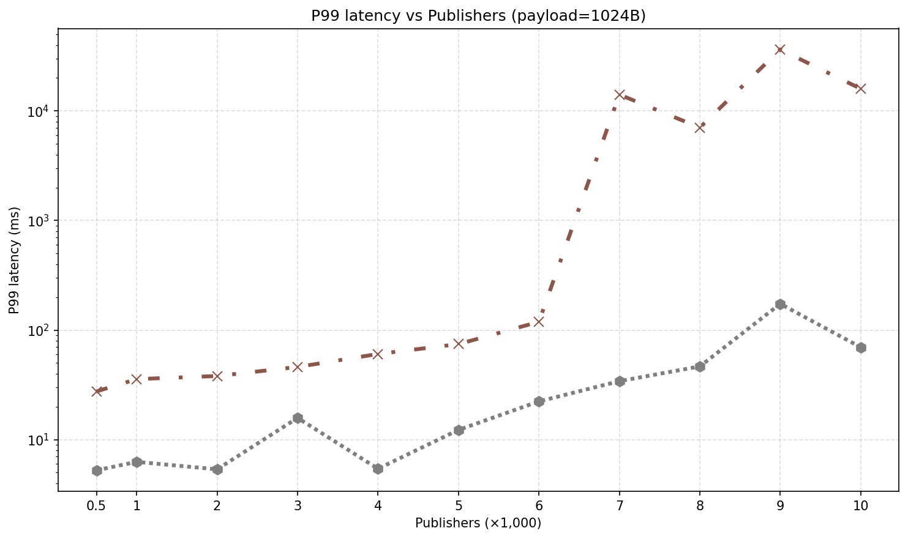

## Resource Usage vs Publishers

### Max CPU%

#### payload=1024B

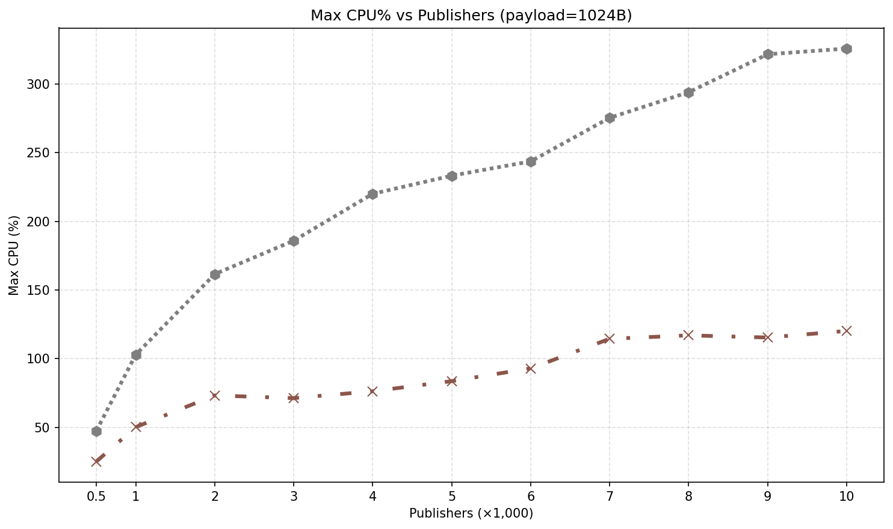

### Max Memory%

#### payload=1024B

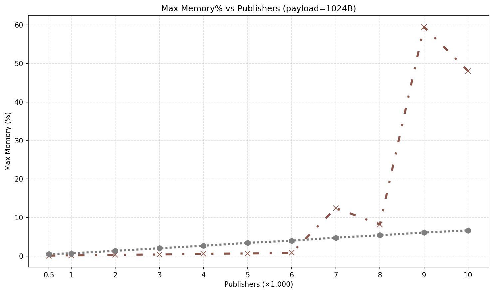

### Avg CPU%

#### payload=1024B

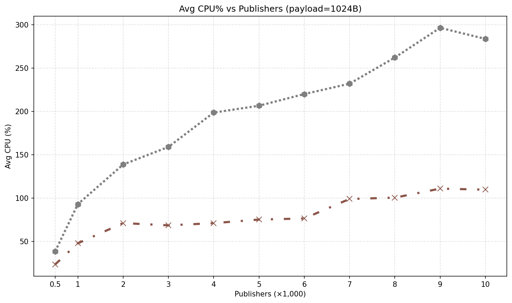

### Avg Memory%

#### payload=1024B

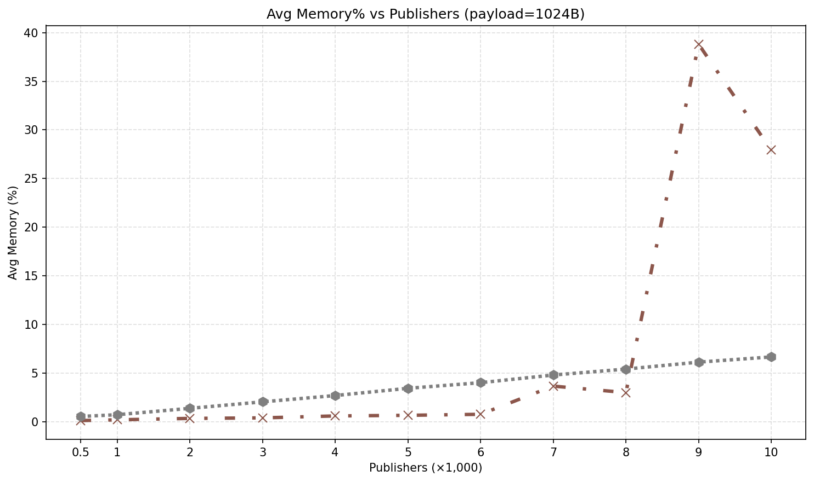

### Avg CPU Cores Used

#### payload=1024B

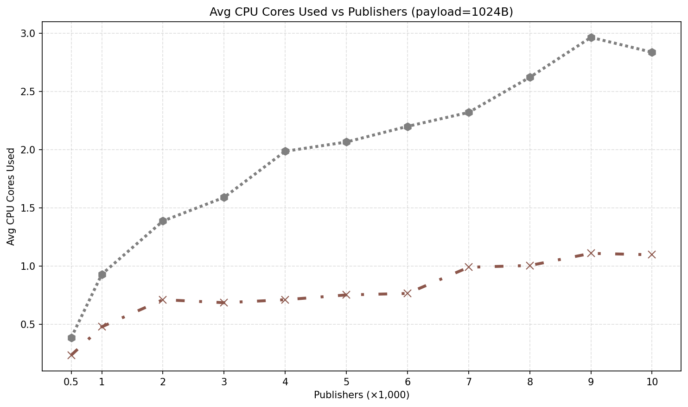

### Avg Memory (GB)

#### payload=1024B

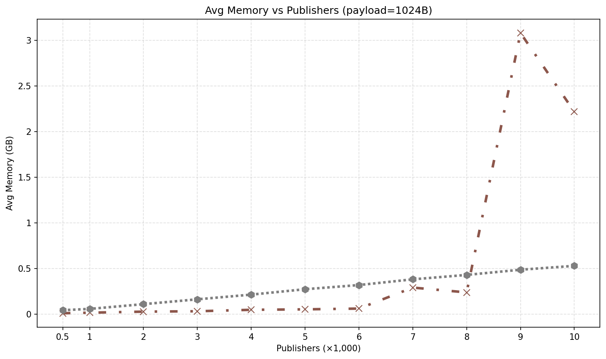

## Network Usage vs Publishers

### Peak Receive Bandwidth

#### payload=1024B

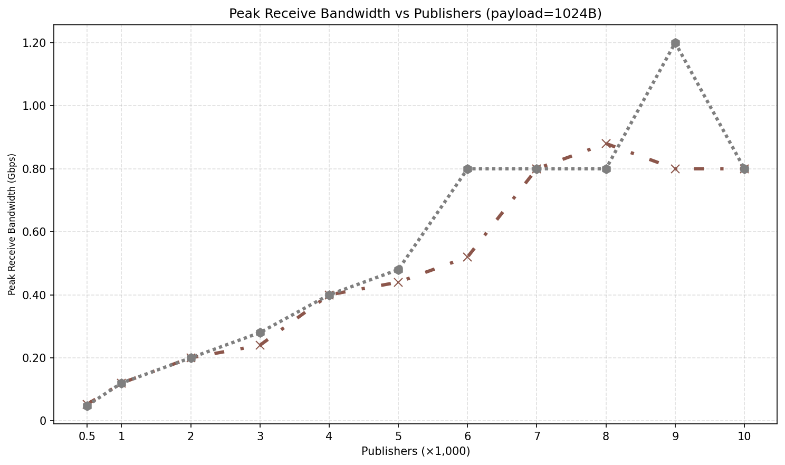

### Peak Transmit Bandwidth

#### payload=1024B

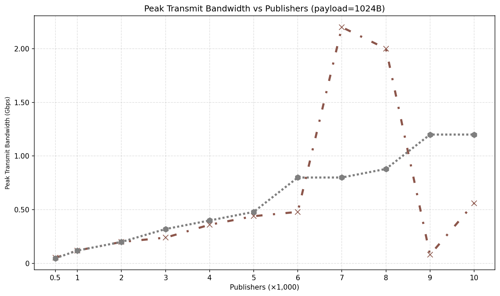

### Average Receive Bandwidth

#### payload=1024B

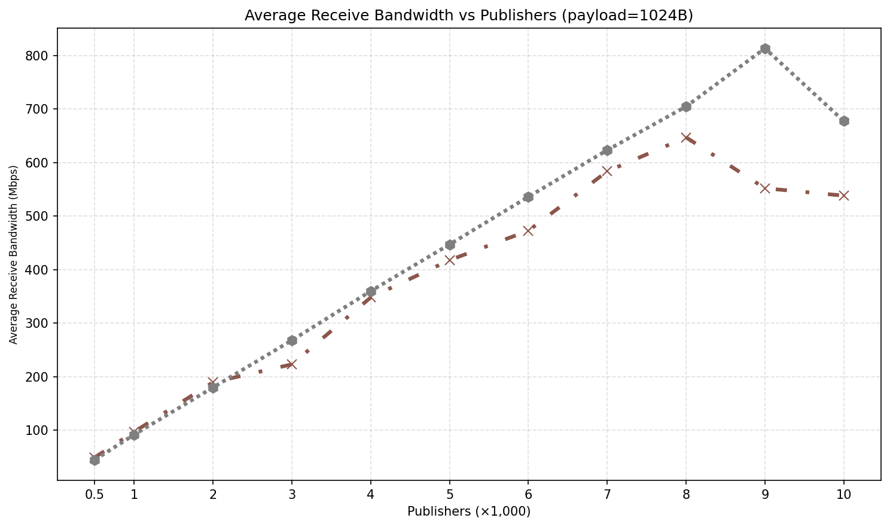

### Average Transmit Bandwidth

#### payload=1024B

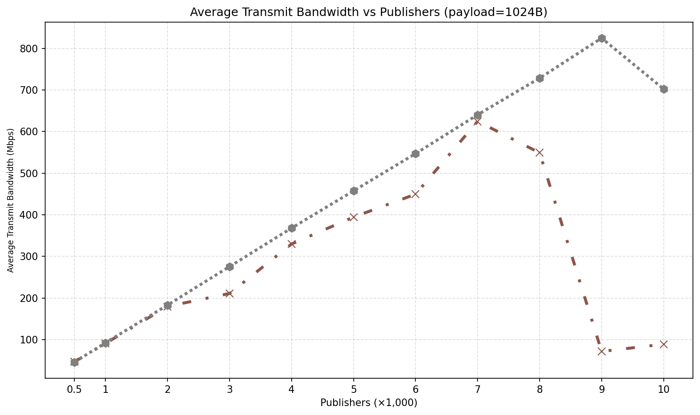

